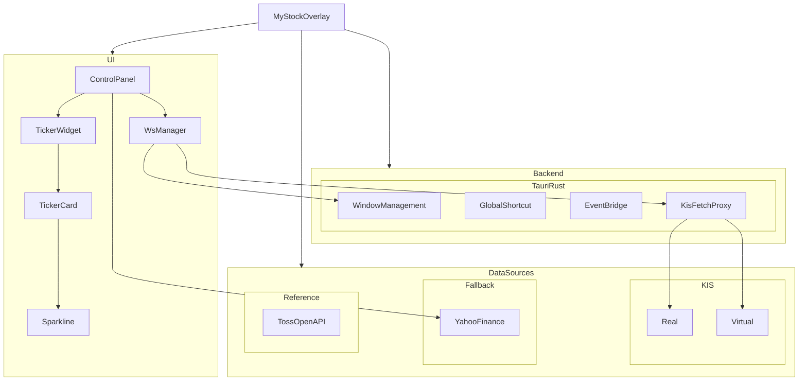

# MyStockOverlay 아키텍처

MyStockOverlay는 Tauri v2, React 19, Vite, TypeScript 기반의 데스크톱 주가 오버레이 앱입니다. 메인 제어 패널과 여러 개의 독립 티커 창으로 나뉘며, Tauri를 통해 창 제어, 전역 단축키, Rust와 프론트엔드 간 이벤트 전달을 처리합니다.

## 전체 구조 다이어그램

## 시스템 개요

- 프론트엔드
  - `ControlPanel`
  - `TickerWidget`
  - `TickerCard`
  - `Sparkline`
  - `WsManager`
  - 역할: 종목 관리, 티커 렌더링, 데이터 조정
- 백엔드
  - Tauri Rust 명령
  - 전역 단축키 처리
  - 창 상태 관리
  - KIS 요청 프록시
  - 역할: 창 제어, 클릭 패스쓰루, 이벤트 브로드캐스트
- 데이터 소스
  - KIS 실전 API
  - KIS 모의투자 API
  - Yahoo Finance 폴백
  - 역할: 현재가, 분봉 차트, 장애 시 대체 데이터 제공

## 하위 문서

- [프론트엔드 구조](./FRONTEND_ARCHITECTURE.md)
- [데이터 소스와 브리지 구조](./DATA_ARCHITECTURE.md)

## 한 줄 요약

- `src/`는 화면과 데이터 흐름을 담당하고, `src-tauri/`는 창 제어와 이벤트 브리지를 담당합니다.
- 현재 데이터 소스는 KIS 실전, KIS 모의투자, Yahoo, 토스입니다.
- 자동 fallback은 없고, 사용자가 데이터 소스를 명시적으로 선택합니다.
